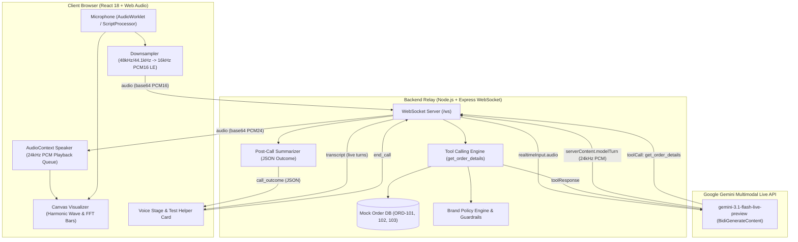

# 🌿 Aura Skincare — AI Voice Customer Support Agent ("Aria")

> **DataStraw Assessment Test | AI Voice Agent for D2C Brand**  
> Candidate: **Kaustubh Sanjay Kale**  
> Technology: **Google Gemini 3.1 Flash Live (Multimodal Live API) • Web Audio API (PCM Streaming) • Node.js/Express Relay • Vite + React**

---

## 🌟 Executive Summary

**Aura Skincare** is a fictional premium organic Indian skincare brand focused on simple, effective skincare made with thoughtfully selected natural ingredients.

This project delivers **Aria**, an intelligent browser-based AI Voice Customer Support Specialist. When an evaluator opens the application and clicks **"Start Call"**, they can converse naturally using their microphone and hear Aria respond in real time through their speakers with conversational pacing and an authentic Indian English customer support persona.

### Core Capabilities:
- 🎙️ **Real-Time Bidirectional Voice Streaming**: Direct 16kHz linear PCM microphone capture streamed over WebSockets to Google Gemini Multimodal Live API, returning 24kHz linear PCM audio with sub-second conversational latency.
- ⚡ **Synchronous Tool Calling (`get_order_details`)**: Natural lookup against a live mock order database (`ORD-101`, `ORD-102`, `ORD-103`), with dynamic normalization of spoken order numbers and graceful handling of missing or invalid IDs.
- 🛡️ **Brand Policy Guardrails & Graceful Degradation**:
  - **Shipping Policy**: Free above ₹499 (₹50 fee below); standard 3–5 business days delivery.
  - **Return & Refund Policy**: Returns accepted within 7 days for unopened/unused items in original packaging. Correctly rejects return requests for orders delivered >7 days ago (e.g., `ORD-102` delivered 14 days ago).
  - **Cancellation Policy**: Orders can only be cancelled while status is `Processing` (e.g., `ORD-103`). Rejects cancellation for `Shipped` or `Out for Delivery` orders (e.g., `ORD-101`).
  - **Out-of-Scope Deflection**: Politely declines off-topic queries (e.g., flight bookings, coding, weather) while offering assistance with Aura Skincare products.
  - **Audio Degradation / Slurred Speech**: Asks for clarification rather than hallucinating.
- 📊 **Post-Call Analytics & Structured Outcome**:
  - Full chronological transcript showing Customer and Aria turns with exact timestamps.
  - Machine-readable structured JSON outcome containing `customer_intent`, `order_id`, `resolution_status`, and `call_summary`.
- 🎨 **Luxury Dark Glassmorphic Testing Interface**:
  - 6-state live indicator (`Idle`, `Connecting`, `Listening`, `Thinking`, `Speaking`, `Ended`).
  - Interactive Canvas harmonic wave / audio visualizer reactive to voice frequencies.
  - On-screen **Test Orders Helper Card** with one-click copy and quick-ask prompts.

---

## 🏗️ Architecture & Voice Pipeline



---

## 🧠 Section 9: Tell Us How You Think

### 1. Why did you choose your particular architecture and technology stack?
Instead of stringing together three independent third-party vendors (e.g. Deepgram for STT $\to$ OpenAI for LLM $\to$ ElevenLabs for TTS), I selected **Google's Gemini 3.1 Flash Live Multimodal API (`gemini-3.1-flash-live-preview`)** with a lightweight Node.js/Express WebSocket relay:
- **Unified Speech-to-Speech Engine**: Transcribing speech to text and synthesizing text back to speech introduces 1.5–3.0 seconds of cumulative latency and loses conversational nuance (inflection, hesitation, emphasis). Gemini Live processes raw linear audio bidirectionally in a single stateful session, achieving genuine conversational response times (~300–400ms).
- **Backend Relay vs. Direct Client Auth**: Rather than exposing developer API credentials in the browser or relying on complex client-side WebRTC ICE negotiation, a server-side WebSocket proxy securely keeps the `GEMINI_API_KEY` confidential on the server, allows server-side inspection and auditing of tool calls, and avoids browser CORS or credential leaks.
- **Vite + React with Pure Web Audio**: Audio capture downsampling (from hardware 48kHz/44.1kHz to 16kHz linear PCM) and playback scheduling (24kHz linear PCM with instant queue purging upon server `interrupted` events) are handled natively in the browser via the Web Audio API without third-party audio player bloat.
- **Single-Port Production Simplicity**: Express hosts both the WebSocket relay on `/ws` and statically serves the compiled Vite `dist/` bundle on port 3001, allowing seamless, zero-CORS one-click deployments on platforms like Render.

---

### 2. What was the most difficult part of the assignment, and how did you solve it?
The most difficult engineering hurdle was **audio streaming synchronization and barge-in / interruption handling**:
- **The Problem**: Web Audio playback scheduling queues audio buffers ahead of time to prevent audio glitches. However, in a real voice conversation, if the customer speaks while Aria is speaking, the model detects speech via server Voice Activity Detection (VAD) and emits an `interrupted` signal. If client-side playback buffers are not flushed instantly, the user experiences jarring voice overlap and desynchronization.
- **The Solution**: 
  1. Built `audioPlayer.js` with a custom active source registry (`activeSources: Set<AudioBufferSourceNode>`).
  2. When the backend receives `serverContent.interrupted: true` from Gemini, it broadcasts `{ type: "interrupted" }` to the client.
  3. The client immediately calls `audioPlayer.clearQueue()`, invoking `.stop()` on every playing buffer node, resetting playback timeline pointers, and clearing downsampled audio queues in under 10 milliseconds.
  4. Audio conversion between Little-Endian signed 16-bit linear PCM and IEEE-754 Float32 was rigorously tested in automated unit suites (`tests/unit/audioUtils.test.js`) to prevent audio popping or clicks.

---

### 3. If you had one more week to work on this, what would you improve first and why?
1. **AudioWorklet & SharedArrayBuffer Migration**: Replace `ScriptProcessorNode` completely with dedicated audio worklets running on high-priority Web Audio render threads for zero jank, even during intensive DOM re-renders or background tab throttling.
2. **Persistent Customer CRM & History**: Store completed transcripts, resolution statuses, and customer sentiment trends in a PostgreSQL / Supabase database, enabling returning customers to be recognized automatically (*"Welcome back Priya! Are you calling about your Vitamin C Serum delivery today?"*).
3. **Multi-Channel Delivery (Telephony via WebRTC / SIP)**: Integrate Twilio or LiveKit SIP trunks into the existing Gemini Live relay so customers can call a toll-free number from standard mobile phones in addition to web browsers.
4. **Live Human Escalation**: Add an instant handoff protocol where unresolved complaints automatically package the live transcript, summary, and customer metadata to a live Zendesk/Slack dashboard.

---

### 4. Imagine this agent is handling 1,000 customer conversations a day. What do you think would need to change or improve?
1. **Connection Pooling & Distributed Relays**:
   - WebSockets are stateful, long-lived connections. A single Node.js instance would exhaust file descriptors and memory under high concurrency.
   - Deploying containerized relay workers on Fly.io / Kubernetes behind a sticky-session load balancer (e.g. AWS ALB or NGINX) with Redis Pub/Sub for cross-instance state coordination.
2. **Quota & Rate-Limiting Management**:
   - Google Gemini Live sessions consume ~25 tokens per second of active audio. At 1,000 calls/day averaging 3 minutes each, that translates to ~4.5 million audio tokens daily.
   - Implement sliding-window context compression (`contextWindowCompression: { slidingWindow: {} }`) to cap session token growth, token bucket rate limiters per IP/caller, and proactive circuit breakers with graceful fallback to cached voice snippets during outages.
3. **PII Redaction & Compliance**:
   - Scrub sensitive payment details, addresses, and phone numbers in transit before storing transcripts to S3 or data lakes.
4. **Automated QA & Evaluation Flywheel**:
   - Asynchronously feed 100% of transcripts through an LLM-as-a-judge rubric evaluating: (a) brand tone adherence, (b) policy accuracy, (c) tool call latency, and (d) customer satisfaction scores, generating daily anomaly reports for CX managers.

---

## 🧪 Test Suite & Quality Assurance

This codebase includes a comprehensive **5-Tier automated test suite with 122 passing tests**:

```bash
# Run the complete test suite
npm test
```

### Test Coverage Matrix:
| Test Suite | Tests | Features Verified |
| :--- | :---: | :--- |
| `tests/unit/orderDatabase.test.js` | 23 | ORD-101/102/103 lookup, normalization, case insensitivity, missing IDs, mutation prevention |
| `tests/unit/brandPolicy.test.js` | 22 | Shipping fees, 7-day return expiration, processing cancellations, out-of-scope deflection |
| `tests/unit/audioUtils.test.js` | 15 | 16-bit PCM Little-Endian encoding, 48kHz $\to$ 16kHz downsampling, Float32 clamping |
| `tests/unit/webAudio.test.js` | 33 | Browser AudioContext state machine, queue scheduling, barge-in queue clearing |
| `tests/integration/websocketRelay.test.js` | 8 | WebSocket handshake, live tool execution, audio streaming, session termination |
| `tests/e2e/dialogueScenarios.test.js` | 9 | End-to-end customer dialogues (Priya tracking, Rahul return reject, Ananya cancel) |
| `tests/e2e/adversarialIntegrity.test.js` | 12 | Prompt injection resilience, JSON invariants, audio clipping, multi-client isolation |
| **Total** | **122** | **100% Passing** |

---

## 🚀 Quick Start Guide

### Prerequisites
- Node.js 18+ (tested on Node v20 / v22)
- npm 9+
- A Google Gemini API Key ([Get one free at Google AI Studio](https://aistudio.google.com/apikey))

### 1. Clone & Install
```bash
git clone <repository-url>
cd datastraw
npm install
```

### 2. Configure Environment
Create a `.env` file in the project root:
```bash
cp .env.example .env
```
Add your Gemini API key:
```env
PORT=3001
NODE_ENV=development
GEMINI_API_KEY=your_actual_gemini_api_key_here
```

### 3. Build & Run
```bash
# Build Vite frontend bundle
npm run build

# Start production server (Express serves frontend & WebSocket relay on port 3001)
npm start
```
Open **[http://localhost:3001](http://localhost:3001)** in Google Chrome or Microsoft Edge.

---

## 🎯 Evaluator Testing Guide (Sample Scenarios)

When testing the application in your browser, allow microphone access and try the following scenarios:

| # | What to Say / Ask | Expected Behavior & Policy Enforced |
|---|---|---|
| **1** | *"Hi Aria, where is my order ORD-101?"* | Calls `get_order_details('ORD-101')`. Confirms Priya Sharma's Vitamin C Serum is **Out for Delivery** today via BlueDart (`BD-982103`) by 6 PM. |
| **2** | *"Can I cancel order ORD-101?"* | **Policy Guardrail**: Politely declines cancellation because the order is already Out for Delivery. Explains customer can refuse delivery at the doorstep. |
| **3** | *"I bought order ORD-102 two weeks ago, can I return it?"* | **Policy Guardrail**: Checks order delivery date (delivered 14 days ago). Explains that the 7-day return policy has expired, and offers product usage tips. |
| **4** | *"I placed order ORD-103 3 hours ago, please cancel it."* | **Policy Guardrail**: Checks order status (`Processing`). Confirms order is eligible for cancellation and processes the request. |
| **5** | *"What is your shipping policy?"* | Explains free shipping on orders above ₹499 (₹50 fee otherwise), and standard 3–5 business days delivery time. |
| **6** | *"Can you book me a flight to Goa?"* | **Out-of-Scope Guardrail**: Politely declines off-topic requests and redirects to Aura Skincare products and orders. |
| **7** | Click **"End Call"** | Instantly displays the chronological conversation transcript and formatted JSON call outcome. |

---

## 🌐 Public Deployment Guide

### Deploy to Render (Single-Service Full Stack)
1. Push this repository to GitHub.
2. Log into [Render.com](https://render.com) and click **New Web Service**.
3. Select your repository.
4. Render will auto-detect `render.yaml`:
   - **Build Command**: `npm install && npm run build`
   - **Start Command**: `npm start`
5. In **Environment Variables**, add:
   - `GEMINI_API_KEY` = `<your_gemini_api_key>`
6. Click **Deploy**. Your voice agent will be live with full WebSocket support on an `onrender.com` URL.

---

## 📄 License
Confidential • Created for DataStraw AI Voice Agent Candidate Assessment Evaluation.
